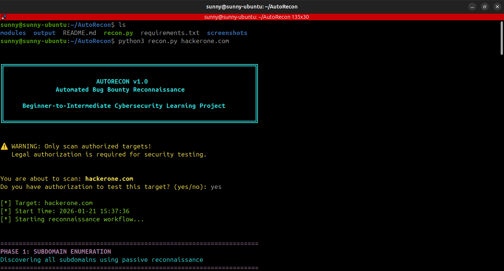
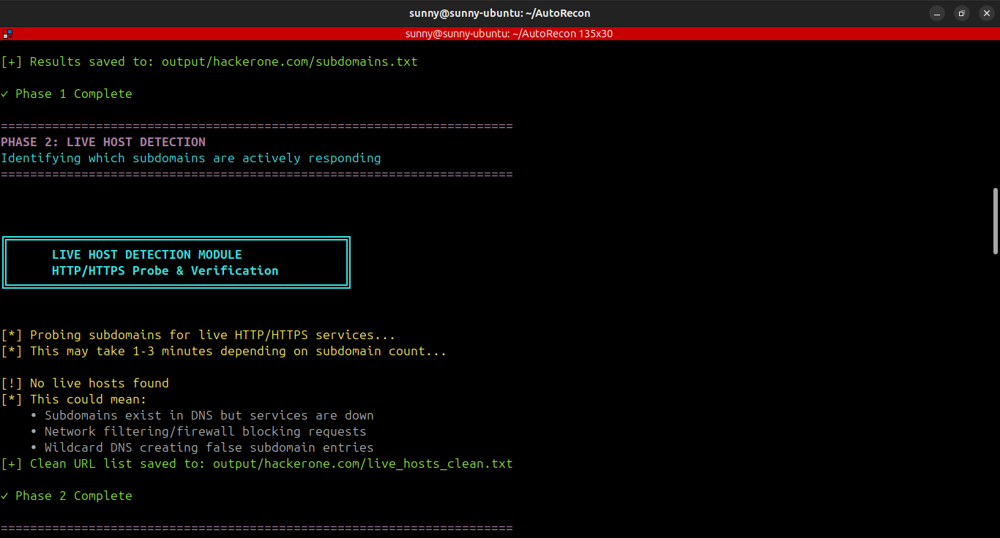

<div align="center">

# 🔍 AutoRecon

### Automated Reconnaissance Framework for Bug Bounty Hunters

[](https://www.python.org/downloads/)
[](LICENSE)
[](https://www.linux.org/)
[](https://github.com)

*A modular Python framework that automates the reconnaissance phase of security assessments using industry-standard tools and methodologies.*

[Features](#-features) • [Installation](#-installation) • [Usage](#-usage) • [Demo](#-demonstration) • [Documentation](#-reconnaissance-workflow)

</div>

---

## ✨ Features

<table>
<tr>
<td width="50%">

### 🎯 Core Capabilities
- **5-Phase Automated Pipeline**  
  Complete reconnaissance workflow
  
- **Passive Reconnaissance**  
  Stealthy OSINT techniques
  
- **Modular Architecture**  
  Run phases independently or together

</td>
<td width="50%">

### 📊 Intelligence Output
- **Professional Reports**  
  Risk categorization & recommendations
  
- **Organized Results**  
  Structured data per target
  
- **Educational Code**  
  Learn cybersecurity concepts

</td>
</tr>
</table>

---

## 🚀 Quick Start

---

## 🚀 Quick Start

```bash
# 1. Clone repository
git clone <your-repo-url>
cd AutoRecon

# 2. Install dependencies
sudo apt update && sudo apt install -y nmap golang-go

# 3. Install security tools
go install -v github.com/projectdiscovery/subfinder/v2/cmd/subfinder@latest
go install -v github.com/projectdiscovery/httpx/cmd/httpx@latest
go install github.com/tomnomnom/waybackurls@latest

# 4. Configure PATH
export PATH=$PATH:~/go/bin

# 5. Run reconnaissance
python3 recon.py target.com
```

---

## 🎬 Demonstration

### Terminal Output

<div align="center">

<p><em>Real-time reconnaissance execution with color-coded phases</em></p>
</div>

### Sample Execution

```bash
$ python3 recon.py hackerone.com
```bash
$ python3 recon.py hackerone.com
```

<details>
<summary><b>📋 View Full Output</b></summary>

```
╔════════════════════════════════════════════════════════════════════╗
║                         AUTORECON v1.0                             ║
║              Automated Bug Bounty Reconnaissance                   ║
╚════════════════════════════════════════════════════════════════════╝

[*] Target: hackerone.com
[*] Starting reconnaissance workflow...

======================================================================
PHASE 1: SUBDOMAIN ENUMERATION
======================================================================

[+] Found 247 subdomains
[+] Results saved to: output/hackerone.com/subdomains.txt

======================================================================
PHASE 2: LIVE HOST DETECTION
======================================================================

[+] Found 189 live hosts
Protocol Distribution:
  • HTTPS: 185 hosts
  • HTTP:  4 hosts

======================================================================
PHASE 3: PORT SCANNING & SERVICE DETECTION
======================================================================

[+] api.hackerone.com - 5 open ports:
    Port 80     | http            | Cloudflare http proxy
    Port 443    | ssl/http        | Cloudflare http proxy
    Port 8080   | http            | Cloudflare http proxy
    
⚠️  WARNINGS:
    • Port 8080 (HTTP-Proxy) - Alternative HTTP, often admin panels

======================================================================
PHASE 4: URL & ENDPOINT COLLECTION
======================================================================

[+] Total Historical URLs: 12,453

API Endpoints Found: 47
  → Test for: Authentication bypass, IDOR, data exposure

Admin/Login Panels: 23
  → Test for: Default credentials, SQL injection

🚨 CRITICAL - Sensitive Files: 8
  → HIGH PRIORITY: Check for exposed credentials, configs

======================================================================
PHASE 5: REPORT GENERATION
======================================================================

[+] Report generated successfully!
[+] Saved to: output/hackerone.com/recon_report.txt

======================================================================
RECONNAISSANCE COMPLETE!
======================================================================
Duration: 0:08:34
```

</details>

### 📊 Generated Report

<div align="center">

<p><em>Professional reconnaissance report with risk categorization</em></p>
</div>

<details>
<summary><b>📄 View Report Preview</b></summary>
```
======================================================================
               AUTOMATED RECONNAISSANCE REPORT
======================================================================

Target Domain:    hackerone.com
Scan Date:        2026-01-21 14:22:54
Framework:        AutoRecon v1.0

EXECUTIVE SUMMARY
----------------------------------------------------------------------

KEY METRICS:
  • Subdomains Discovered:     247
  • Live Hosts Confirmed:      189
  • Hosts Port Scanned:        189
  • Historical URLs Found:     12,453
  • API Endpoints Identified:  47
  • Admin Panels Discovered:   23
  • Sensitive Files Found:     8

RISK SUMMARY:
  🚨 CRITICAL: 8 sensitive files discovered
  ⚠️  HIGH:     23 admin panels identified
  ⚠️  MEDIUM:   47 API endpoints found

RECOMMENDATIONS & NEXT STEPS
----------------------------------------------------------------------

1. CRITICAL - Review Sensitive Files
   • Check for .env files, .sql dumps, .zip backups
   • Look for exposed credentials or API keys

2. HIGH - Test Admin Panels
   • Verify accessibility
   • Test for default credentials
   • Check for SQL injection vulnerabilities

3. MEDIUM - API Endpoint Testing
   • Map API structure and versioning
   • Test authentication mechanisms
   • Check for IDOR vulnerabilities
```

</details>

---

## 🏗️ Architecture

---

## 🏗️ Architecture

<div align="center">

```
┌─────────────────────────────────────────────────────────────┐
│                      AUTORECON FRAMEWORK                     │
└─────────────────────────────────────────────────────────────┘
                              │
                    ┌─────────▼─────────┐
                    │    recon.py       │
                    │  (Orchestrator)   │
                    └─────────┬─────────┘
                              │
         ┌────────────────────┼────────────────────┐
         │                    │                    │
    ┌────▼────┐         ┌────▼────┐         ┌────▼────┐
    │ Phase 1 │         │ Phase 2 │         │ Phase 3 │
    │Subdomain│────────▶│  Live   │────────▶│  Port   │
    │  Enum   │         │  Hosts  │         │  Scan   │
    └─────────┘         └─────────┘         └─────────┘
                              │
                    ┌─────────┴─────────┐
               ┌────▼────┐         ┌────▼────┐
               │ Phase 4 │         │ Phase 5 │
               │   URL   │────────▶│ Report  │
               │Collector│         │   Gen   │
               └─────────┘         └─────────┘
                                        │
                              ┌─────────▼─────────┐
                              │   OUTPUT FILES    │
                              │  • subdomains.txt │
                              │  • live_hosts.txt │
                              │  • port_scans/    │
                              │  • urls/          │
                              │  • report.txt     │
                              └───────────────────┘
```

</div>

### 📁 Project Structure

```
AutoRecon/
├── 🎯 recon.py                    # Main orchestrator
├── 📦 modules/
│   ├── subdomain_enum.py          # Phase 1: Subdomain discovery
│   ├── live_hosts.py              # Phase 2: HTTP/HTTPS probing
│   ├── port_scan.py               # Phase 3: Port/service detection
│   ├── url_collector.py           # Phase 4: Wayback Machine URLs
│   └── report.py                  # Phase 5: Report generation
├── 📊 output/
│   └── <target>/                  # Organized results per target
└── 📸 screenshots/                # Demo images for README
```

---

## 🔄 Reconnaissance Workflow

<table>
<tr>
<th width="5%">Phase</th>
<th width="20%">Module</th>
<th width="35%">Description</th>
<th width="20%">Tool</th>
<th width="20%">Type</th>
</tr>
<tr>
<td align="center">1️⃣</td>
<td><b>Subdomain Enumeration</b></td>
<td>Discover subdomains via Certificate Transparency logs and DNS databases</td>
<td><code>Subfinder</code></td>
<td><span style="color: green;">🟢 Passive</span></td>
</tr>
<tr>
<td align="center">2️⃣</td>
<td><b>Live Host Detection</b></td>
<td>Multi-threaded HTTP/HTTPS probing with technology detection</td>
<td><code>Httpx</code></td>
<td><span style="color: orange;">🟠 Semi-passive</span></td>
</tr>
<tr>
<td align="center">3️⃣</td>
<td><b>Port Scanning</b></td>
<td>Nmap service version detection on top 1000 ports</td>
<td><code>Nmap</code></td>
<td><span style="color: red;">🔴 Active</span></td>
</tr>
<tr>
<td align="center">4️⃣</td>
<td><b>URL Collection</b></td>
<td>Historical endpoint discovery via Wayback Machine</td>
<td><code>Waybackurls</code></td>
<td><span style="color: green;">🟢 Passive</span></td>
</tr>
<tr>
<td align="center">5️⃣</td>
<td><b>Report Generation</b></td>
<td>Professional summary with risk categorization</td>
<td><code>Python</code></td>
<td>📝 Analysis</td>
</tr>
</table>

---

## 🛠️ Installation

### Prerequisites

---

## 🛠️ Installation

### Prerequisites

- **OS:** Linux (Ubuntu/Debian recommended)
- **Python:** 3.8 or higher
- **Tools:** Git, Go 1.19+

### Step-by-Step Setup

<details open>
<summary><b>1️⃣ System Dependencies</b></summary>

```bash
sudo apt update
sudo apt install -y nmap golang-go git
```

</details>

<details open>
<summary><b>2️⃣ Security Tools</b></summary>

```bash
# Subfinder - Subdomain enumeration
go install -v github.com/projectdiscovery/subfinder/v2/cmd/subfinder@latest

# Httpx - HTTP probing
go install -v github.com/projectdiscovery/httpx/cmd/httpx@latest

# Waybackurls - Historical URL discovery
go install github.com/tomnomnom/waybackurls@latest
```

</details>

<details open>
<summary><b>3️⃣ Configure Environment</b></summary>

```bash
# Add Go binaries to PATH
export PATH=$PATH:~/go/bin
echo 'export PATH=$PATH:~/go/bin' >> ~/.bashrc
source ~/.bashrc
```

</details>

<details open>
<summary><b>4️⃣ Verify Installation</b></summary>

```bash
subfinder -version
httpx -version
nmap --version
waybackurls -h
```

</details>

---

## 💻 Usage

### Full Automated Scan

```bash
python3 recon.py target.com
```

### Individual Modules

Run specific reconnaissance phases independently:

```bash
# Phase 1: Subdomain enumeration
python3 modules/subdomain_enum.py target.com

# Phase 2: Live host detection
python3 modules/live_hosts.py target.com

# Phase 3: Port scanning
python3 modules/port_scan.py target.com

# Phase 4: URL collection
python3 modules/url_collector.py target.com

# Phase 5: Report generation
python3 modules/report.py target.com
```

### 📂 Output Structure
### 📂 Output Structure

All reconnaissance results are organized per target:

```
output/target.com/
├── 📄 subdomains.txt              # All discovered subdomains
├── 🌐 live_hosts.txt              # Active hosts with metadata
├── 🔗 live_hosts_clean.txt        # Clean URL list for next phases
├── 🔍 port_scans/                 # Nmap results per host
│   ├── host1_scan.txt
│   └── host2_scan.txt
├── 📡 urls/                       # Categorized URL findings
│   ├── all_urls.txt               # Complete URL collection
│   ├── api_endpoints.txt          # API paths discovered
│   ├── admin_panels.txt           # Admin/login pages
│   ├── sensitive.txt              # Sensitive files (.env, .sql, etc.)
│   └── parameters.txt             # URLs with query parameters
└── 📊 recon_report.txt            # Comprehensive final report
```

---

## ⚠️ Legal Disclaimer

<div align="center">

### ⚖️ AUTHORIZED USE ONLY

This tool is designed for **educational purposes** and **authorized security testing** exclusively.

</div>

#### ✅ Authorized Use Cases

| Scenario | Requirements |
|----------|--------------|
| 🏠 **Personal Infrastructure** | Your own domains and servers |
| 🎯 **Bug Bounty Programs** | Within stated program scope |
| 🔐 **Penetration Testing** | Signed contract with target owner |
| 🎓 **Educational Labs** | Controlled learning environments |

#### ❌ Prohibited Activities

- Scanning targets without explicit written permission
- Violating terms of service or acceptable use policies
- Unauthorized network reconnaissance
- Any activity violating CFAA or similar laws

> **⚠️ Important:** Unauthorized scanning is illegal and unethical. Always obtain proper authorization before testing. The authors assume no liability for misuse of this tool.

---

## 📚 Learning Outcomes

By building and using AutoRecon, you will learn:

<table>
<tr>
<td width="50%">

### 🎯 Security Concepts
- Reconnaissance methodology
- Attack surface mapping
- OSINT techniques
- Risk categorization
- Professional pentesting workflow

</td>
<td width="50%">

### 💻 Technical Skills
- Python automation & subprocess management
- Tool integration & orchestration
- Error handling & logging
- Report generation
- Linux command-line proficiency

</td>
</tr>
</table>

---

## 🤝 Contributing

Contributions are welcome! Here's how you can help:

- 🐛 **Report Bugs:** Open an issue with detailed reproduction steps
- ✨ **Suggest Features:** Share ideas for new reconnaissance modules
- 📖 **Improve Docs:** Fix typos or enhance documentation
- 🔧 **Submit PRs:** Add new features or fix existing issues

---

## 📜 License

```
MIT License

Copyright (c) 2026 AutoRecon

Permission is hereby granted, free of charge, to any person obtaining a copy
of this software for educational and authorized security testing purposes.
```

---

<div align="center">

### 🔐 Built by Security Enthusiasts, for Security Learners

**Star ⭐ this repository if you find it helpful!**

[](https://github.com/yourusername/AutoRecon)
[](https://github.com/yourusername/AutoRecon/fork)

---

**Happy Hacking! 🎯**

</div>
